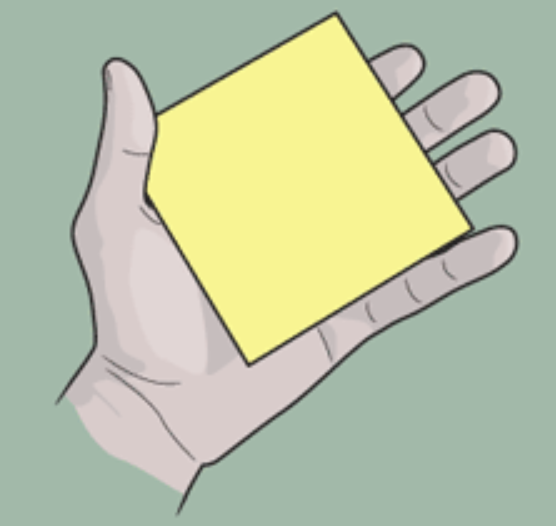
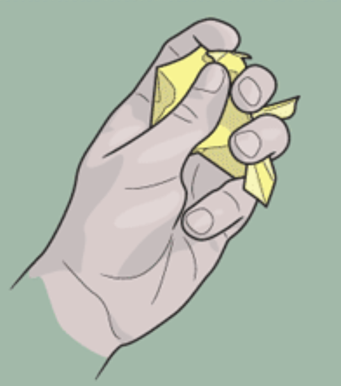

# Configure an existing Data Connector

Explain how the user can do an interesting and important thing with your project. Write specific steps and describe the successful outcome.

Identify anything particular that users need before they can start:

* One thing
* Another thing.

## User flow overview

Accomplishing the use case with this feature involves doing these things:

1. Doing the first thing
2. Doing the second thing
3. Doing the third thing

### Do the first thing

**Prerequisites**: List anything that must be done before the user can begin the task. If they need to have certain files open, or have accomplished a specific previous task, let them know and link to it.

To do the first thing, follow these steps:

1. A thing
2. Another thing
3. What?! More?

Describe the successful outcome of the task and list any next steps that the user needs to complete before they can achieve the main use case for this feature.

### Do the second thing

**Prerequisites**: List anything that must be done before the user can begin the task. If they need to have certain files open, or have accomplished a specific previous task, let them know and link to it.

To do the second thing, follow these steps:

1. A thing
2. Another thing
3. What?! More?

Describe the successful outcome of the task and list any next steps that the user needs to complete before they can achieve the main use case for this feature.

### Doing the third thing

**Prerequisites**: List anything that must be done before the user can begin the task. If they need to have certain files open, or have accomplished a specific previous task, let them know and link to it.

To do the third thing, follow these steps:

1. A thing
2. Another thing
3. What?! More?

 Describe the successful outcome of the task and list any activities they can do to get more value from the feature.

## Write your own example: accomplishing the supported use case with a common situation!

For convenience, this example assumes x,y, and z.

### Do the first thing

1. In the specific application, open the specific file.
2. Do the next thing
3. Do another thing.

Now, your thing looks like this and you can move on to the second thing:

### Do the second thing

1. In the specific application, find the specific settings.
2. Do the next thing.
3. Do another thing.

Now, your thing appears as follows and you can move onto the third thing:

### Do the third thing

1. In the specific application, set the specific parameters.
2. Do the next thing.
3. Do another thing.

You have now accomplished the supported use case and have a functioning feature.

## Reference information
Include a list of limitations, unsupported use cases, tables, log messages, and parameter or code references here.
